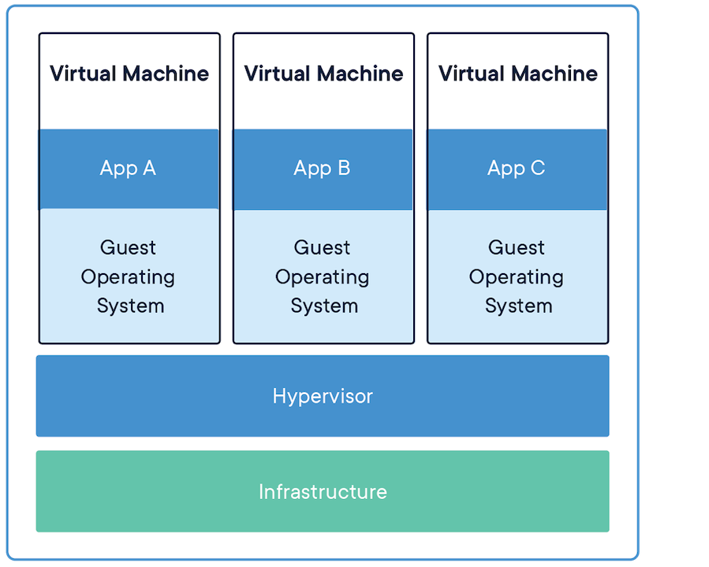

## Containers – What Are They and Why Do I Need Them When I Have a VM?

### Slide 1: Introduction to Containers
- **Definition**: A container is a lightweight, portable, and self-sufficient software package that includes everything needed to run an application.
- **Key Features**:
  - Isolated processes.
  - Shared OS kernel.
  - Lightweight compared to VMs.
- **Image Example**:
  

<A Href="./Docker-02.md">Next Page</a>
---
  ## Open in Google Cloud Shell

You can directly open this repository in Google Cloud Shell to start exploring the examples:

---

## License

This project is licensed under the MIT License. See the `LICENSE` file for details.

## Contact

For questions or feedback, feel free to reach out:

- **Email**: eyal@levys.co.il
- **GitHub**: [https://github.com/elevy99927](https://github.com/elevy99927)
