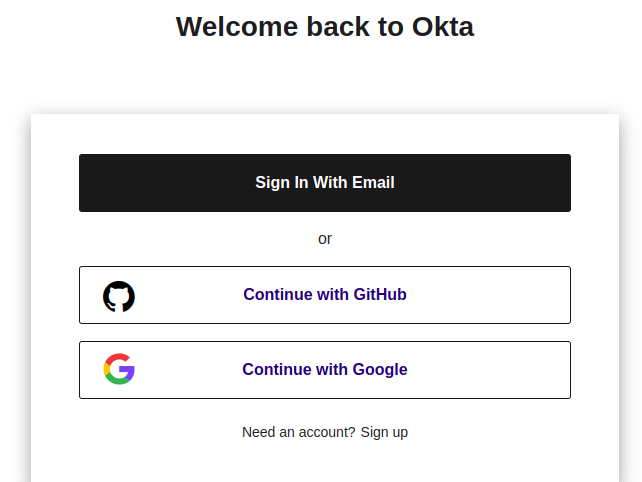
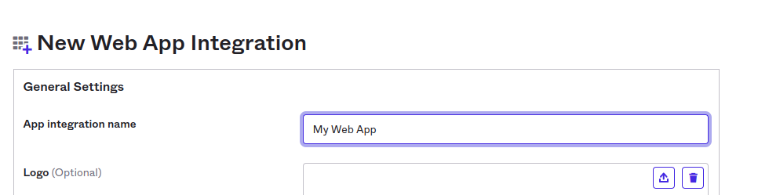

# Github / Google
Verify you have a valid Github or Google account

# Create okta developer account
<a href="https://developer.okta.com/login/">https://developer.okta.com/login/</a>

# Create new app
Go to application -> Create New App

# Create OIDC Web App

## General Settings
### Set app name

### Sing in URLs

<B>Sign-in redirect URIs</B> https://k8soidc.10.100.102.82.nip.io/auth/oidc/callback

<B>Sign-out redirect URIs</B> https://k8soidc.10.100.102.82.nip.io/

### Assignments
Select Allow everyone in your organization to access and <B>"Save"</B>

# Client Credentials and CLIENT SECRETS
## *** Be sure you saved your Client ID and client Secret ***

