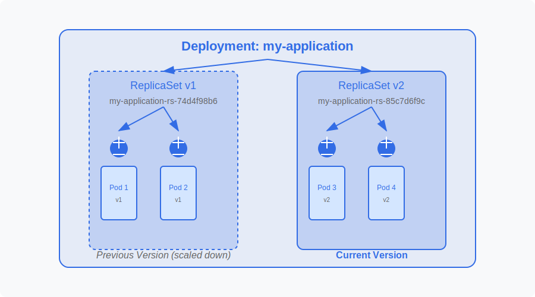

# Kubernetes Course

## Foundation: Kubernetes Core Concepts

### Goal: Learn Kubernetes fundamentals, its architecture, and how to deploy workloads

## 1. Key Kubernetes Components

Kubernetes consists of core building blocks that help manage containerized applications efficiently. This section covers **Pods, Deployments, ReplicaSets, Services, and Endpoints** to provide a complete understanding of Kubernetes workloads and networking.

### Pods

A **Pod** is the smallest deployable unit in Kubernetes. It encapsulates one or more containers that share storage, networking, and specifications on how they should run.

- Pods are ephemeral by default; if a Pod fails, it is not automatically replaced unless managed by a **ReplicaSet** or **Deployment**.
- Each Pod is assigned a unique IP address within the cluster.
- Containers within a Pod share networking and can communicate via `localhost`.

**Hands-on: Create Your First Pod**
```sh
kubectl create pod my-pod --image=nginx
```
This command creates a Pod named `my-pod` using the **nginx** image from Docker Hub.

### Deployments

A **Deployment** is a higher-level Kubernetes object that manages Pods using ReplicaSets. It allows for:
- **Scaling**: Adjusting the number of running Pods.
- **Rolling updates**: Updating an application without downtime.
- **Self-healing**: Replacing failed Pods automatically.

Deployments create and manage **ReplicaSets**, which ensure a specified number of Pod replicas are running.



**Hands-on: Create a Deployment**
```sh
kubectl create deploy my-deployment --image=nginx
```
This command creates a Deployment named `my-deployment`, which automatically manages a **ReplicaSet** to maintain availability.

### Services

A **Service** exposes a set of Pods to other Pods or external users. Since Pods are ephemeral, their IPs change upon restart. Services provide:
- **Stable networking**: Assigning a fixed IP and DNS name.
- **Load balancing**: Distributing traffic across multiple Pods.
- **Service discovery**: Enabling Pods to locate and communicate with each other.

#### **Hands-on: Expose Your Deployment as a Service**
```sh
kubectl expose deploy my-deployment --port=80 --type=LoadBalancer
```
This command creates a Service that exposes `my-deployment` on port 80 with an external IP (if supported by the environment).

### Service Discovery

Kubernetes provides built-in **service discovery mechanisms** to enable communication between services.
- **Environment Variables**: Kubernetes automatically injects environment variables into Pods containing Service details.
- **DNS-Based Discovery**: Each Service gets a DNS name (`my-service.default.svc.cluster.local`) that other Pods can use for communication.

### Endpoints

An **Endpoint** is a dynamically updated list of Pod IPs associated with a Service. When a new Pod is created or removed, the **Endpoint object** is updated to reflect the change.

To inspect Endpoints for a Service:
```sh
kubectl get endpoints my-deployment
```


---
## **Contact**
For questions or feedback, feel free to reach out:
- **Email**: eyal@levys.co.il
- **GitHub**: [https://github.com/elevy99927](https://github.com/elevy99927)

---
### **Next Steps**
<A href="./Chapter-03.md">Basics  YAMLS for Kubernetes</A>