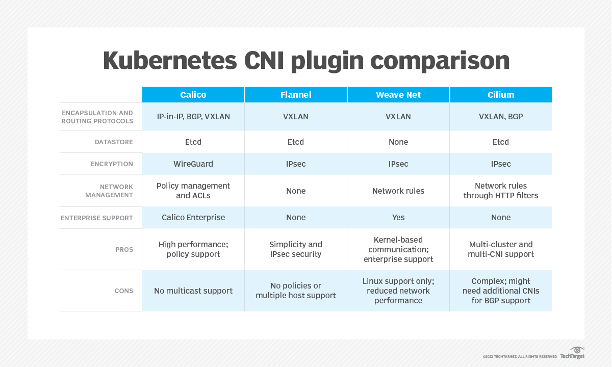

# Kubernetes Networking

## Introduction

This document provides an overview of Kubernetes networking, including its model, communication between pods and services, and network security using policies. The exercises help in understanding how networking works in Kubernetes and how to implement isolation and security measures.

## 1. Networking Model and CNI Plugins

### Overview:
Kubernetes networking is based on a flat, cluster-wide network model where all pods can communicate with each other without NAT. This simplifies communication but requires proper network implementation to scale efficiently. Kubernetes does not include a built-in networking solution; instead, it relies on Container Network Interface (CNI) plugins to provide networking functionalities.

### Key Features of Kubernetes Networking:
- **Pod-to-Pod Communication**: Every pod receives a unique IP address, ensuring direct connectivity.
- **No NAT Between Pods**: Communication between pods occurs without network address translation.
- **Service Abstraction**: Services provide stable network endpoints, abstracting pod IP changes.
- **Extensibility with CNI Plugins**: Various plugins allow customization and network policy enforcement.

### Common CNI Plugins:
- **Calico** – Provides networking and security policy enforcement.
- **Flannel** – Simple overlay network for Kubernetes.
- **Cilium** – Uses eBPF for high-performance networking and security.
- **Weave** – Focuses on simplicity and multi-cloud support.

### CNI Plugins comparation:



## Example: Working with Pod Networking

### 1. Check if CNI is Cilium

To verify whether Cilium is installed and functioning as your CNI (Container Network Interface) plugin:

```sh
kubectl get pods -n kube-system -l k8s-app=cilium
```

You should see one running pod per node. For more detailed status:

```sh
kubectl -n kube-system exec -it <cilium-pod-name> -- cilium status
```

### 2. Network Policies for Isolation

Network Policies in Kubernetes allow you to control traffic flow at the IP address or port level between Pods. This is crucial in microservices environments for isolating sensitive components such as databases.

#### Key Concepts

* **Ingress rules**: Control incoming traffic to a Pod.
* **Egress rules**: Control outgoing traffic from a Pod.
* **Selectors**: Determine which Pods and traffic sources the rules apply to.

#### Simple Example: Deny All Traffic

```yaml
apiVersion: networking.k8s.io/v1
kind: NetworkPolicy
metadata:
  name: deny-all
spec:
  podSelector: {}
  policyTypes:
  - Ingress
  - Egress
```

This policy blocks all traffic to and from all Pods in the namespace.
---

#### Advanced Example: Deny All Traffic

```yaml
apiVersion: networking.k8s.io/v1
kind: NetworkPolicy
metadata:
  name: test-network-policy
  namespace: default
spec:
  podSelector:
    matchLabels:
      role: db
  policyTypes:
  - Ingress
  - Egress
  ingress:
  - from:
    - ipBlock:
        cidr: 172.17.0.0/16
        except:
        - 172.17.1.0/24
    - namespaceSelector:
        matchLabels:
          project: myproject
    - podSelector:
        matchLabels:
          role: frontend
    ports:
    - protocol: TCP
      port: 6379
  egress:
  - to:
    - ipBlock:
        cidr: 10.0.0.0/24
    ports:
    - protocol: TCP
      port: 5978
```
[networkpolicy.yaml](https://github.com/elevy99927/k8s/tree/main/networking/networkpolicy.yaml)
---

## 3. LAB: Apply Network Policy to Web and MySQL

We will create three deployments (`web`, `mysql`, and `attacker`) and validate traffic flow using curl or nc.

### Step 1: Create Web and MySQL Deployments + Services

```yaml
# web-deployment.yaml
apiVersion: apps/v1
kind: Deployment
metadata:
  name: web
spec:
  replicas: 1
  selector:
    matchLabels:
      app: web
  template:
    metadata:
      labels:
        app: web
    spec:
      containers:
      - name: web
        image: busybox
        command: ["sh", "-c", "while true; do sleep 3600; done"]
---
apiVersion: v1
kind: Service
metadata:
  name: web
spec:
  selector:
    app: web
  ports:
  - port: 80
    targetPort: 80
```

```yaml
# mysql-deployment.yaml
apiVersion: apps/v1
kind: Deployment
metadata:
  name: mysql
spec:
  replicas: 1
  selector:
    matchLabels:
      app: mysql
  template:
    metadata:
      labels:
        app: mysql
    spec:
      containers:
      - name: mysql
        image: mysql:5.7
        env:
        - name: MYSQL_ROOT_PASSWORD
          value: password
        ports:
        - containerPort: 3306
---
apiVersion: v1
kind: Service
metadata:
  name: mysql
spec:
  selector:
    app: mysql
  ports:
  - port: 3306
    targetPort: 3306
---
# attacker-deployment.yaml
apiVersion: apps/v1
kind: Deployment
metadata:
  name: attacker
spec:
  replicas: 1
  selector:
    matchLabels:
      app: attacker
  template:
    metadata:
      labels:
        app: attacker
    spec:
      containers:
      - name: attacker
        image: busybox

```

### Step 2: Verify Access from Web to MySQL

```sh
kubectl exec -it <web-pod> -- nc -vz mysql 3306
kubectl exec -it <attacker-pod> -- nc -vz mysql 3306
```

Both pods will return `succeeded` if no policy is applied yet.

### Step 3: Apply Deny-All Policy

```yaml
# deny-all.yaml
apiVersion: networking.k8s.io/v1
kind: NetworkPolicy
metadata:
  name: deny-all
spec:
  podSelector: {}
  policyTypes:
  - Ingress
```

Verify again with `curl` or `nc` – the request should now fail.

### Step 4: Allow MySQL Port Only From Web

```yaml
# allow-mysql-from-web.yaml
apiVersion: networking.k8s.io/v1
kind: NetworkPolicy
metadata:
  name: allow-mysql-from-web
spec:
  podSelector:
    matchLabels:
      app: mysql
  ingress:
  - from:
    - podSelector:
        matchLabels:
          app: web
    ports:
    - protocol: TCP
      port: 3306
```

Verify again
```bash
kubectl exec -it <web-pod> -- nc -vz mysql 3306  # should succeed
kubectl exec -it <attacker-pod> -- nc -vz mysql 3306  # should fail
```

---

## 4. Lab Solutions

All YAML files are available at:
[https://github.com/elevy99927/k8s/tree/main/networking](https://github.com/elevy99927/k8s/tree/main/networking)


---
## **Contact**
For questions or feedback, feel free to reach out:
- **Email**: eyal@levys.co.il
- **GitHub**: [https://github.com/elevy99927](https://github.com/elevy99927)

---
### **Next Steps**
<A href="./Chapter-10.md">Ingress Controllers and Resources</A>