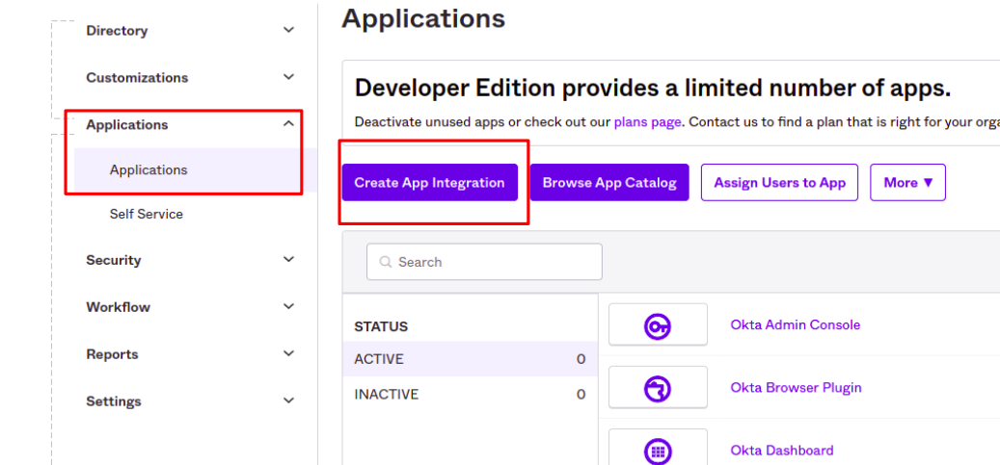

# Github / Google
Verify you have a valid Github or Google account

# Create okta developer account
<a href="https://developer.okta.com/login/">https://developer.okta.com/login/</a>

# Create new app
Go to application -> Create New App

